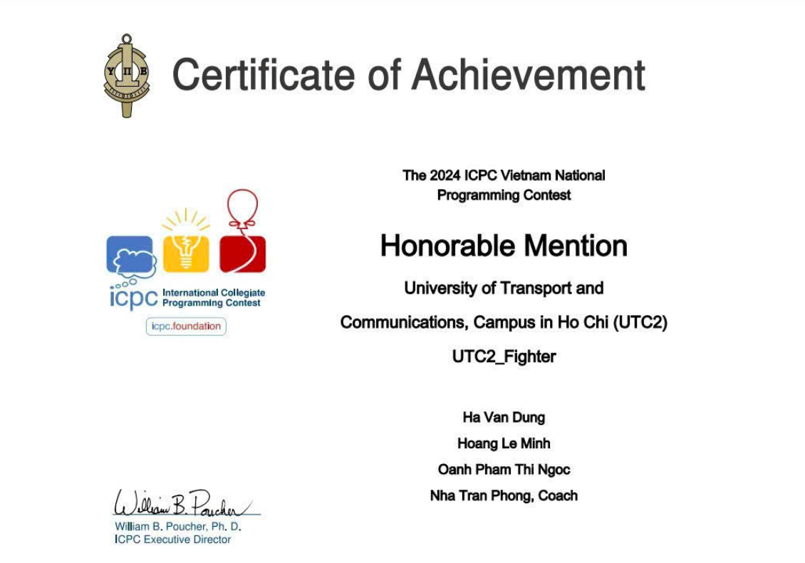
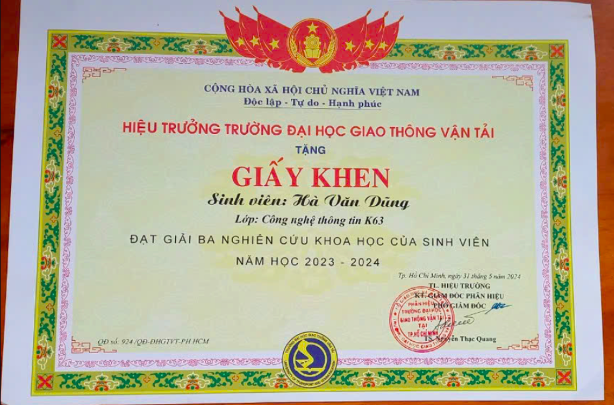

# 🚀 Dung Ken - Fullstack Developer Portfolio

  

  <i>Passionate fullstack developer specializing in modern web technologies and mobile applications.</i>

---

## 📋 Portfolio Overview

Welcome to my comprehensive portfolio repository! This collection showcases my professional development projects, certifications, and technical content creation. I specialize in fullstack development with expertise in:

- 💻 **Frontend**: React, TypeScript, Flutter
- 🔧 **Backend**: Spring Boot, ASP.NET Core, Node.js 
- 🗄️ **Databases**: MySQL, SQL Server, MongoDB, PostgreSQL
- 🚢 **DevOps**: Docker, CI/CD pipelines
- 📱 **Mobile**: Flutter, Dart

I am passionate about creating clean, maintainable code and building intuitive user experiences that solve real-world problems.

---

## 💼 Projects

### 1. ⚡ VinCharge Subscription (Web/Mobile Application)

A comprehensive subscription management platform for electric vehicle charging:

#### Mobile App (Flutter)
* Created a cross-platform application using **Flutter** and **Dart** for electric vehicle charging subscription management
* Implemented comprehensive authentication with login, registration, and password recovery flows
* Built consumption tracking interfaces with image upload for meter readings
* Developed QR code-based payment system integration for subscription fees
* Created a complete multilingual system supporting English and Vietnamese
* Implemented responsive design for different screen sizes and orientations
* Built comprehensive form validation with immediate feedback on input errors

#### Backend (Java/Spring Boot)
* Developed a secure API using **Java 17** and **Spring Boot 3.2.3** with layered architecture
* Implemented VNPay payment gateway integration with secure HMAC-SHA512 validation
* Created comprehensive user, contract, and consumption management APIs
* Built JWT authentication with password reset via OTP verification
* Designed a robust PostgreSQL database schema with proper relationships
* Integrated Cloudinary for image storage and processing
* Implemented asynchronous processing with task executors and scheduled tasks

### 2. 🗣️ Speaking English with AI (Mobile App)

A cross-platform language learning application built with Flutter:

* Developed an AI-powered conversation practice app using **Flutter** and **Dart** following **Clean Architecture** principles
* Implemented interactive conversation features with speech recording, transcription, and AI-powered language feedback
* Created role-play scenarios with contextual conversations between users and AI language partners
* Developed a personalized learning system that targets specific language weaknesses and tracks progress
* Architected the application using **BLoC pattern** for robust state management with clear event-state flows
* Utilized **Hive** and **SharedPreferences** for efficient local data persistence and offline functionality
* Engineered responsive layouts that adapt seamlessly between portrait and landscape orientations
* Implemented comprehensive error handling with the Error Boundary pattern for improved stability
* Designed dependency injection using **GetIt** to create loosely coupled, highly testable components

### 3. 📋 Trello Clone (Web Application)

A sophisticated task management application with kanban-style boards:

#### Frontend (React/Redux)
* Developed a responsive drag-and-drop interface using **React 18** and **Material UI v5**
* Implemented advanced drag-and-drop functionality with **@dnd-kit** including custom collision detection
* Created a comprehensive state management system with **Redux Toolkit** and **Redux Persist**
* Built real-time collaboration features using **Socket.io-client** for instant updates
* Designed a complete authentication flow with JWT handling and protected routes
* Implemented rich text editing with **Markdown** support for card descriptions
* Created responsive layouts that adapt to different screen sizes and devices
* Optimized performance with memo, useMemo, and efficient rendering techniques

#### Backend (Node.js/Express)
* Built a RESTful API using **Node.js**, **Express.js**, and modern JavaScript (ES6+)
* Implemented real-time updates with **Socket.IO** for collaborative editing
* Created comprehensive board, column, and card management with complex operations
* Designed a robust authentication system with JWT access and refresh tokens
* Built a MongoDB data layer with relational modeling and complex aggregations
* Integrated cloud services including file storage and email notifications
* Implemented a versioned API structure with clean separation of concerns

### 4. 🔬 Scientific Research Platform (Web Application)

A comprehensive educational platform for scientific research and knowledge sharing:

#### Frontend (React/TypeScript)
* Built a feature-rich knowledge management system using **React 18**, **TypeScript**, and **Bootstrap 5**
* Implemented a searchable theory database with categorization, keyword indexing, and example-based learning
* Designed an interactive discussion forum with threaded conversations and comment functionality
* Created a content management system for academic articles with categorization and moderation
* Developed a comprehensive admin dashboard for user management and content administration
* Integrated rich text editors (**React Quill** and **CKEditor**) for advanced content creation
* Implemented **JWT authentication** with role-based access control (Admin/Staff/User tiers)

#### Backend (Java/Spring Boot)
* Developed a robust API using **Java 17** and **Spring Boot 3.2.4** following layered architecture
* Implemented an ontology model (COKB) for discrete mathematics education and research
* Created comprehensive APIs for theory management, discussion platform, and content organization
* Built secure user authentication with **JWT** and **Spring Security**
* Designed role-based authorization system with fine-grained permissions
* Used **Spring Data JPA** with **MySQL** for efficient data access and relationship management
* Implemented email service integration for account verification and notifications

### 5. 🛒 E-commerce Platform (Coolmate)

A comprehensive e-commerce solution with both frontend and backend components:

#### Frontend (React/TypeScript)
* Built a responsive e-commerce interface using **React 18**, **TypeScript**, and **Bootstrap 5** following modern component architecture
* Implemented intuitive product browsing with dynamic filtering, category navigation, and search functionality
* Designed interactive product detail pages with image galleries, size/color selection, and add-to-cart capabilities
* Created a complete shopping cart system with persistent storage, real-time price calculations, and checkout flow
* Developed user account management with secure authentication, profile management, and order history
* Integrated **Firebase** (authentication), **Google/Facebook OAuth** (social login) for seamless user experience
* Utilized **React Router v6** for client-side routing and seamless navigation between shopping sections

#### Backend (ASP.NET Core)
* Developed a RESTful API using **C# (.NET 8.0)** and **ASP.NET Core Web API** following clean architecture principles
* Implemented secure authentication with **JWT**, **OAuth**, and **two-factor authentication** via email verification
* Created comprehensive product catalog management with categories, sizes, colors, and image handling
* Built robust order processing and payment handling systems with multiple payment integrations
* Designed a role-based permission system with fine-grained access control
* Used **Entity Framework Core** with **SQL Server** for efficient data management and migrations
* Containerized with **Docker** and **Docker Compose** for seamless deployment
* Integrated cloud services including **Cloudinary** (image storage), **Twilio** (SMS), and email notifications

---

## 🏆 Certifications

### ICPC (International Collegiate Programming Contest)

  

Participated in the prestigious International Collegiate Programming Contest, demonstrating advanced algorithm design and problem-solving skills. The competition challenges teams to solve complex algorithmic problems under time constraints, requiring strong teamwork and technical proficiency.

### NCKH (Nghiên Cứu Khoa Học - Scientific Research)

  

Earned recognition for scientific research achievements in computer science. This certification acknowledges the successful completion of a research project that contributes to the academic field, demonstrating capabilities in methodical investigation, data analysis, and technical writing.

---

## 📚 Educational Content Creation

### Leetcode Top Interview 150 - Video Series

A comprehensive educational series on solving common coding interview problems:

* Created detailed walkthroughs for the top 150 Leetcode interview problems frequently asked at tech companies
* Provided step-by-step explanations with algorithm analysis and complexity discussions
* Shared optimal solutions with time and space complexity improvements
* Demonstrated edge case handling and interview strategies
* Covered essential data structures (arrays, linked lists, trees, graphs) and algorithms (dynamic programming, backtracking, sorting)
* Produced over 38 video tutorials
* Created a structured learning path from basic to advanced problems

> 🔗 [**YouTube Playlist: Leetcode Top Interview 150**](https://www.youtube.com/playlist?list=PLE9QkkVvuT1kc_pgqSPTvgggPg37ZHA6V)

Sample videos from the series:
1. [Merge Sorted Array](https://www.youtube.com/watch?v=180pSPU00-4&list=PLE9QkkVvuT1kc_pgqSPTvgggPg37ZHA6V&index=2&t=198s)
2. [Remove Element](https://www.youtube.com/watch?v=l7NfNKud6Zw&list=PLE9QkkVvuT1kc_pgqSPTvgggPg37ZHA6V&index=3)
3. [Remove Duplicates from Sorted Array](https://www.youtube.com/watch?v=ldO-XEOMj0Y&list=PLE9QkkVvuT1kc_pgqSPTvgggPg37ZHA6V&index=4)
4. [Majority Element](https://www.youtube.com/watch?v=spFa8WjW9BU&list=PLE9QkkVvuT1kc_pgqSPTvgggPg37ZHA6V&index=6&t=2s)
5. [Game of Life](https://www.youtube.com/watch?v=NLoB8CJTlD8&list=PLE9QkkVvuT1kc_pgqSPTvgggPg37ZHA6V&index=39)

---

## 💻 Technical Skills

### Frontend Development

### Backend Development

### Databases

### DevOps & Tools

### Cloud & Services

### Technical Expertise

#### Frontend Development
- **UI Frameworks**: Extensive experience with React component architecture, Flutter widget system, and responsive design patterns
- **State Management**: Expertise in Redux, Context API, BLoC pattern, and reactive programming models
- **Performance Optimization**: Proficient in render optimization, lazy loading, and efficient state updates
- **Cross-Platform**: Skilled in developing applications that work seamlessly across browsers and devices

#### Backend Development
- **API Design**: RESTful API design with proper resource modeling and versioning
- **Authentication**: Implementation of secure authentication systems with JWT, OAuth, and MFA
- **Database Design**: Schema design, relationship modeling, and query optimization
- **Performance**: Caching strategies, database indexing, and query optimization techniques

#### Architecture & System Design
- **Microservices**: Design and implementation of service-oriented architectures
- **Clean Architecture**: Application of SOLID principles and clean code practices
- **Security**: Implementation of comprehensive security measures including data encryption and secure authentication
- **Scalability**: Design for horizontal scaling and high availability

---

## 📊 Project Statistics

| Project | Technologies | Development Time | Lines of Code |
|---------|--------------|----------------|--------------|
| E-commerce Platform | React, .NET, SQL Server | 4 months | ~35,000 |
| Speaking English with AI | Flutter, Dart | 3 months | ~25,000 |
| Scientific Research Platform | React, Spring Boot, MySQL | 2.5 months | ~30,000 |
| Trello Clone | React, Node.js, MongoDB | 2 months | ~20,000 |
| VinCharge Subscription | Flutter, Spring Boot, PostgreSQL | 3 months | ~28,000 |

---

## 🔗 Connect With Me

  

---

## 🌱 Future Directions

I'm actively expanding my expertise in these emerging areas:

* **Cloud-Native Development**: Kubernetes orchestration, service mesh architectures, and cloud-native patterns
* **Machine Learning Integration**: Implementing ML models in web and mobile applications, particularly in NLP and computer vision
* **Web3 Technologies**: Exploring blockchain integration and decentralized application architecture
* **Advanced Mobile Patterns**: Complex animation systems, AR features, and cross-platform optimization techniques
* **Microservice Architecture**: Event-driven design, message queues, and distributed systems

---

**⭐ Thank you for exploring my portfolio! ⭐**

<i>Let's connect and build something amazing together.</i>

